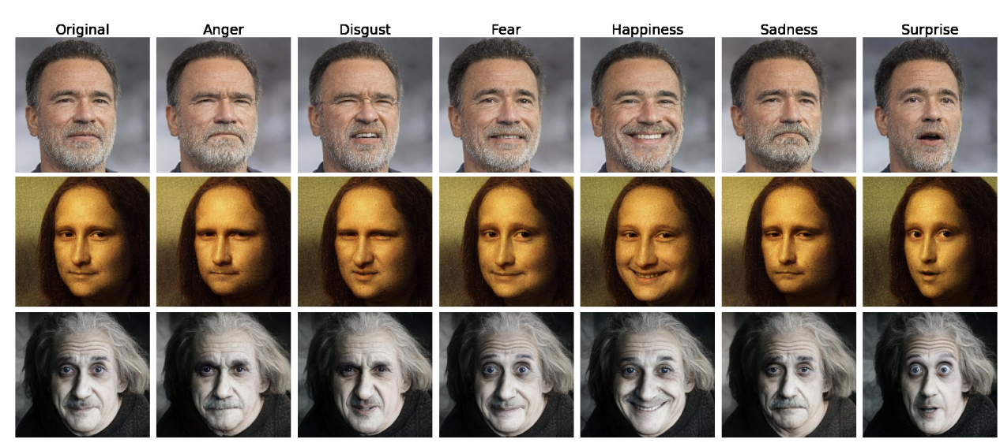
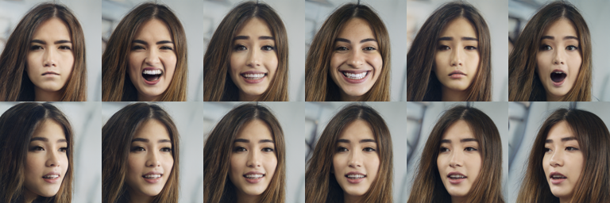

# tensorgan
CVPRW2022 - Tensor-based Emotion Editing in the StyleGAN Latent Space

[](https://www.python.org/downloads/release/python-38/)
[](https://pytorch.org/)

[](https://arxiv.org/abs/2205.06102)

<!-- [Poster](docs/resources/poster.pdf) |
[Demo](demo.ipynb)  -->
### Tensor-based Emotion Editing in the StyleGAN Latent Space
#### René Haas and Stella Graßhof and Sami S. Brandt  
*Presented at the AI for content creation workshot at CVPR2022 in New Orleans*



**Abstract**
 
> In this paper, we use a tensor model based on the Higher-Order Singular Value Decomposition (HOSVD) to discover semantic directions in Generative Adversarial Networks. This is achieved by first embedding a structured facial expression database into the latent space using the e4e encoder. Specifically, we discover directions in latent space corresponding to the six prototypical emotions: anger, disgust, fear, happiness, sadness, and surprise, as well as a direction for yaw rotation. These latent space directions are employed to change the expression or yaw rotation of real face images. We compare our found directions to similar directions found by two other methods. The results show that the visual quality of the resultant edits are on par with State-of-the-Art. It can also be concluded that the tensor-based model is well suited for emotion and yaw editing, i.e., that the emotion or yaw rotation of a novel face image can be robustly changed without a significant effect on identity or other attributes in the images.

## Method


We use the [Binghamton University 3D Facial Expression (BU-3DFE)](https://www.cs.binghamton.edu/~lijun/Research/3DFE/3DFE_Analysis.html) dataset.

The images are projected into the latent space using the encoder for editing (e4e) by 
[Tov et. al. (SIGGRAPH 2021)](https://github.com/omertov/encoder4editing)

By constructing a model based on the Higer-Order Singular Value Decomposition of the latent representation of the data, we propose a method to factorize the latent space of a pretrained StyleGAN model in to different, semantically meaningful, subspaces. 


## Setup environment

```
conda env create -f environment/research.yml
conda activate research 
```
        
## Download pretrained StyleGAN2 model
```
wget https://nvlabs-fi-cdn.nvidia.com/stylegan2-ada-pytorch/pretrained/transfer-learning-source-nets/ffhq-res1024-mirror-stylegan2-noaug.pkl 
mv ffhq-res1024-mirror-stylegan2-noaug.pkl pretrained_models/ffhq-res1024-mirror-stylegan2-noaug.pkl 
```


##  Example Use 


```python
import torch
from models.StyleGANWrapper import StyleGAN
from tensormodel_pytorch import Manipulator
from imgutils import image_grid

path = "pretrained_models/ffhq-res1024-mirror-stylegan2-noaug.pkl"

sg = StyleGAN(path, latentspace_type="wp")

m = Manipulator(directions_path = "directions/directions.pt")

w = sg.sample(seed = 4875)

w_edits = [m.apply_expression(w, expr_idx=expr_idx,strength=s) for expr_idx, s in zip(range(6), (4,3,3,3,3,1.5))]
imgs = [image_grid(sg.synthesize(w)).resize((128,128)) for w in w_edits]
im_exr = image_grid(imgs)

w_edits = [m.apply_rotation(w, strength=s) for s in torch.linspace(-0.5,0.5,6)]
imgs = [image_grid(sg.synthesize(w)).resize((128,128)) for w in w_edits]
im_rot = image_grid(imgs)

im = image_grid([im_exr,im_rot], rows = 2, cols = 1)
im.save("assets/demo.png")
```


## Directions checkpoint
Due to license restrictiction we cannot release the directions found using the BU-3DFE Dataset.

We are looking into releasing precalculated directions on a less restrictive dataset soon. 
